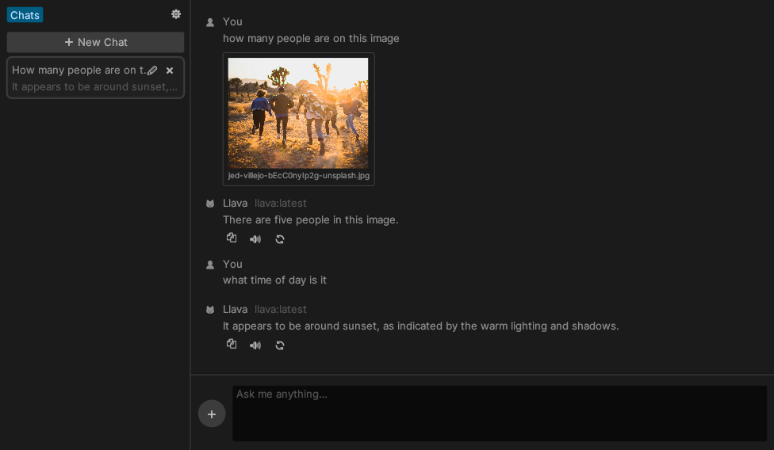

<div class="oranda-hide">

# 🦙 Ellama [](https://github.com/zeozeozeo/ellama)

</div>

Ellama is a friendly interface to chat with a local or remote [Ollama](https://ollama.com/) instance.


# Features

- **Chat History**: create, delete and edit model settings per-chat.
- **Multimodality**: easily use vision capabilities of any multimodal model, such as [LLaVA](https://ollama.com/library/llava).
- **Ollama**: no need to install new inference engines, connect to a regular [Ollama](https://ollama.com/) instance instead.
- **Resource Efficient**: minimal RAM and CPU usage.
- **Free**: no need to buy any subscriptions or servers, just fire up a local Ollama instance.

# Quickstart

1. Download the latest Ellama release from the [Releases](https://github.com/zeozeozeo/ellama/releases) page.
   - or build & install from source:
     ```bash
     $ git clone https://github.com/zeozeozeo/ellama.git
     $ cd ellama
     $ cargo install --path .
     ```
2. In the Settings ⚙️ tab, change the Ollama host if needed (default is `http://127.0.0.1:11434`)
3. In the same tab, select a model that will be used for new chats by default. Ellama will try to select the best model on the first run.
4. Close the Settings tab, create a new chat by pressing the "➕ New Chat" button, and start chatting!
5. To add images, click the ➕ button next to the text field, drag them onto Ellama's window, or paste them from your clipboard.

> [!NOTE]
> By default, Ellama will build with the `tts` feature OFF. If you need TTS, build with `cargo build --features tts`.
>
> Note that on Linux, this requires `libspeechd` (`libspeechd-dev`) to be installed. TTS is currently not enabled in release builds because of this (cross-compilation complications), see https://github.com/zeozeozeo/ellama/issues/71

# Gallery

[](https://github.com/user-attachments/assets/39c0498a-f4cd-4e01-95f1-6a1034413340)





# Wishlist

These features are not yet present in Ellama, but they would be nice to have:

- Support OpenAI-Compatible APIs: currently only has Ollama support
- A "Notes" section, where you can edit and write LLM-assisted notes
- Publish on crates.io: currently still relies on some git dependencies

# License

Unlicense OR MIT OR Apache-2.0
